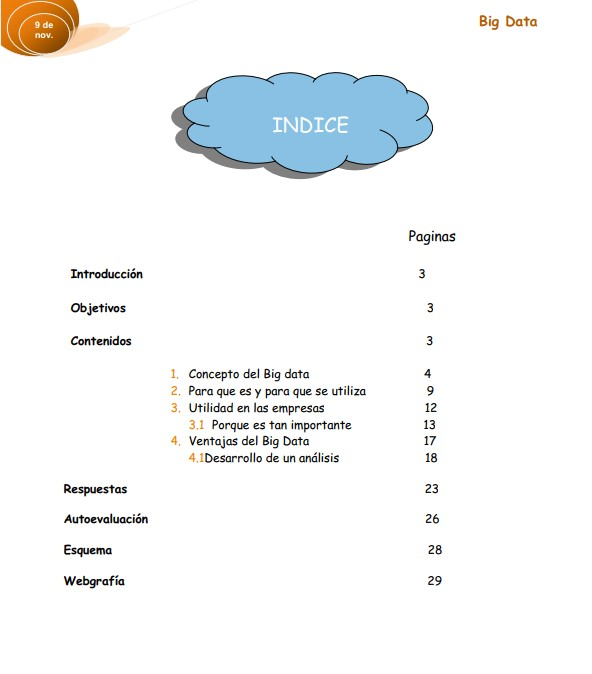

# Big_Data
Denntro de la formacion de docente para la formacion profesional, certificado de profesonalidad (SSCE0110), en la unidad didactica correspondiente del modulo de
formacion MF1443_3 y MF1444_3, tenemos que realizar una exposicion e Unidad formativa del tema escogido, en mi caso conocimientos basicos del `BIG DATA`
y su funcionalidad en las empresas

## Screenshots
 

## Index
Detallamos desde el concepto del `BIG DATA` , como su utlidad, la importancia en las empresas, ventajas y desventajas del mismo, en la presentacion de la Unidad Formativa

 

 ## Presentation
 En una master_class impartimos durante una hora, todo el conocimineto aprendido para mostrarlo a los alumnos  del curso de docencia

  
